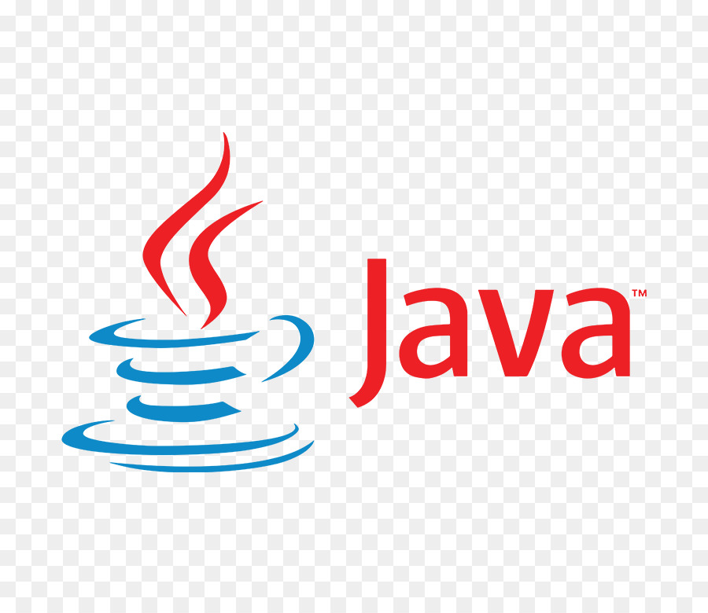
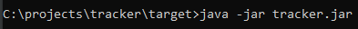
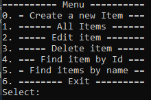

# job4j_tracker

# Tracker
First project of online course [job4j.ru](https://job4j.ru/).

The project is a repository for applications. 
It can all CRUD operations with applications.

## Technology

    
    
    

##### Course knowledge in practise:
- ***Java Core*** (syntaxis, OOP, collections).
- ***Patterns*** - Strategy, Decorator.
- ***Checkstyle*** - static code analysis tool.
- ***JUnit*** - library for unit testing.
- ***Maven*** - framework for automating the assembly of projects.
- ***Git*** - distributed version control system.
- ***Travis CI*** - service for assembling and testing software.

---
## Project API:
- add application.
- update application.
- delete application.
- delete all applications.
- find application by name.
- find application by id.

---
## Project environment

Run project by a console:

---
## In use
Application work by handling user console input and process it.
User select action in menu then enter requirement data.

##### Menu actions:
- **Create a new Item** - add application in the repository.
- **All Items** - get all applications in the repository.
- **Edit Item** - update application in the repository.
- **Delete Item** - delete application in the repository.
- **Find Item By Id** - find by ID application in the repository.
- **Find Item By Name** - find by Name application in the repository.
- **Exit** - Exit from application.

---